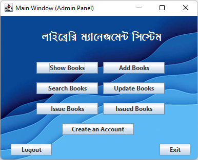

### Installation

- Install XAMPP Server & Java Runtime Environment(JRE)
- Start MySQL & Apache
- Open PHPMyAdmin `http://localhost/phpmyadmin`
- Create a database named `lms`
- Import db.sql to `lms` database from phpmyadmin
- Download the release `.jar` from github release
- Run it

#### Admin Login Details

- admin
- 123

#### Student Login Details

- 201
- 123A

#### Project Preview

